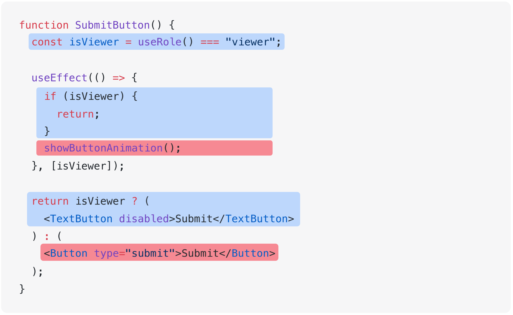
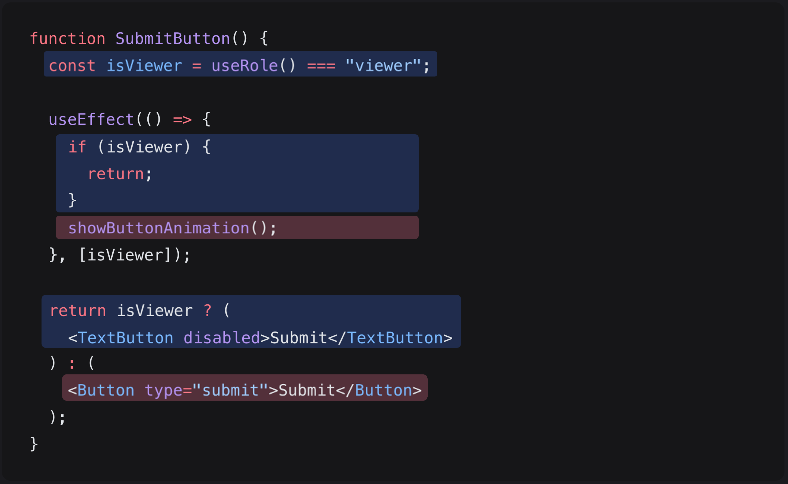

# 같이 실행되지 않는 코드 분리하기

<div style="margin-top: 16px">
  <Badge type="info" text="좋은 코드의 기준" />
  <Badge type="info" text="가독성" />
  <Badge type="info" text="맥락 줄이기" />
</div>

## 🔔 상황

동시에 실행되지 않는 여러 맥락이 하나의 함수나 컴포넌트에 있으면, 구현 부분에 많은 분기가 추가됩니다. 이는 함수나 컴포넌트의 동작을 파악하기 어렵게 만들어 역할을 이해하는 데 어려움을 줄 수 있습니다.

## 🎳 해결법

함수나 컴포넌트는 하나의 맥락만 관리하도록 하고, 분기는 상위 함수 또는 상위 컴포넌트에서 단 하나로 처리합니다.

## 📝 코드 예시

아래 `<SubmitButton />` 컴포넌트는 사용자의 권한에 따라 다르게 동작합니다.

- 사용자의 권한이 보기 전용(`"viewer"`)이면, 제출 버튼은 비활성화되어 있고, 애니메이션도 재생하지 않습니다.
- 사용자가 일반 사용자이면, 제출 버튼은 활성화되어 있고, 애니메이션도 재생합니다.

```tsx
function SubmitButton() {
  const isViewer = useRole() === "viewer";

  useEffect(() => {
    if (isViewer) {
      return;
    }
    showButtonAnimation();
  }, [isViewer]);

  return isViewer ? (
    <TextButton disabled>Submit</TextButton>
  ) : (
    <Button type="submit">Submit</Button>
  );
}
```

## 👃 코드 냄새 맡아보기

`<SubmitButton />` 컴포넌트는 사용자의 두 가지 권한 상태를 하나의 컴포넌트 내에서 동시에 처리하고 있습니다. 이로 인해 코드를 읽는 사람은 한 번에 두 가지 맥락을 고려해야 합니다.

예를 들어, 아래 코드에서 파란색은 사용자가 보기 전용 권한(`"viewer"`)을 가질 때 실행되며, 빨간색은 일반 사용자일 때 실행됩니다. 서로 다른 맥락의 코드가 교차되어 나타나기 때문에, 컴포넌트의 동작을 파악하는 데 어려움을 줄 수 있습니다.

{.light-only}
{.dark-only}

## ✏️ 개선해보기

아래 코드는 사용자의 권한에 따라 '보기 전용'과 '일반 사용자'의 맥락을 완전히 분리하여 관리하는 방식입니다.

```tsx
function SubmitButton() {
  const isViewer = useRole() === "viewer";

  return isViewer ? <ViewerSubmitButton /> : <AdminSubmitButton />;
}

function ViewerSubmitButton() {
  return <TextButton disabled>Submit</TextButton>;
}

function AdminSubmitButton() {
  useEffect(() => {
    showAnimation();
  }, []);

  return <Button type="submit">Submit</Button>;
}
```

- `<SubmitButton />` 곳곳에 있던 분기가 단 하나로 통합되어 분기가 줄어들었습니다.
- `<ViewerSubmitButton />`과 `<AdminSubmitButton />` 은 각각 하나의 맥락만 관리하므로, 코드를 읽는 사람이 한 번에 고려해야 할 맥락이 적습니다.
