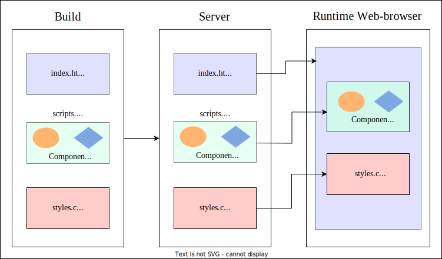
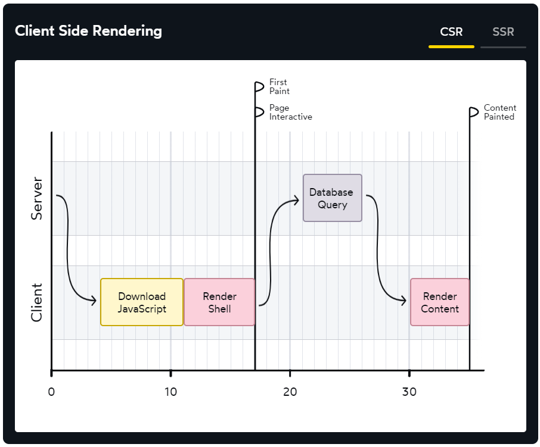
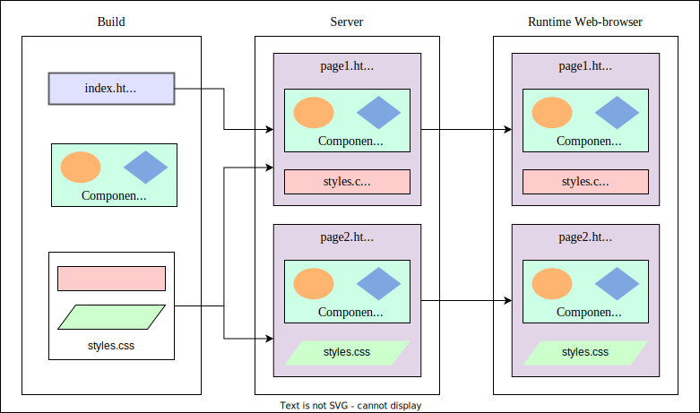
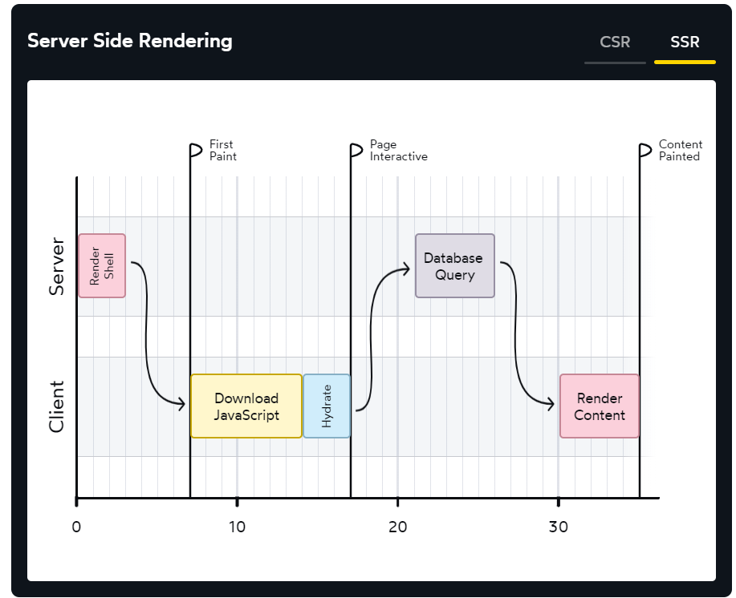
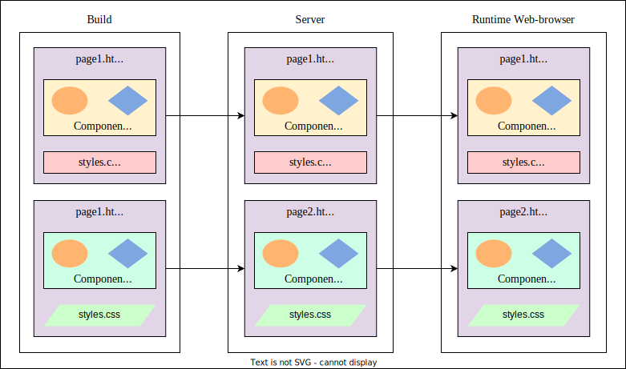
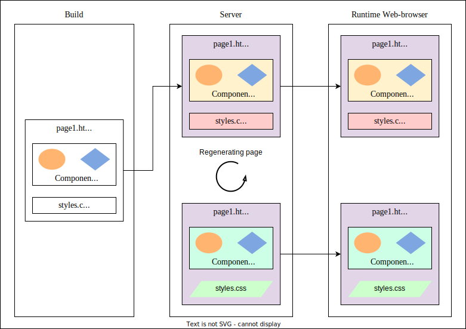

# CSR, SSR, SSG, ISR 알아보기

## CSR(Client-Side Rendering)

클라이언트 사이드 렌더링(CSR)은 JavaScript를 사용해 브라우저에서 직접 콘텐츠를 렌더링하는 방식입니다.

초기 로딩 시, 브라우저는 최소한의 콘텐츠만 포함된 기본 HTML 파일을 불러옵니다. 이후 JavaScript와 스타일을 로드하면서 브라우저에서 전체 페이지가 렌더링됩니다.

```html
<html lang="en">
  <head>
    <script src="/static/bundle.js"></script>
    <link rel="stylesheet" href="/static/style.css" />
  </head>
  <body>
    <div id="root"></div>
  </body>
</html>
```





:::info

- **First Paint**: 사용자가 빈 화면이 아닌 초기 UI 요소를 볼 수 있는 단계입니다. 이 시점에서는 기본적인 레이아웃이 렌더링되었지만, 주요 콘텐츠는 아직 표시되지 않았을 수 있습니다. 이를 **FCP(First Contentful Paint)**라고 합니다.
- **Page Interactive**: 페이지가 완전히 하이드레이션(Hydration)되어 인터랙티브 요소가 정상적으로 작동하는 상태입니다. 이를 **TTI(Time to Interactive)**라고 합니다.
- **Content Paint**: 데이터베이스에서 데이터를 가져와 사용자에게 핵심 콘텐츠를 렌더링한 상태입니다. 가장 중요한 시각적 요소가 표시되는 시점으로, 이를 **LCP(Largest Contentful Paint)**라고 합니다.

:::

이 방식은 서버의 부하를 줄이는 데 효과적입니다.

그러나 번들 크기가 커질수록 렌더링 시간이 길어지고, 그동안 사용자는 빈 화면을 보게 될 수 있습니다. 또한, JavaScript 기반 렌더링은 검색 엔진이 콘텐츠를 제대로 색인화하지 못할 가능성이 있어 SEO(검색 엔진 최적화)에 불리할 수 있습니다.

이러한 한계를 극복하기 위해 서버 사이드 렌더링(SSR)이 등장했습니다.

## SSR(Server-Side Rendering)

서버 사이드 렌더링(SSR)은 HTML 콘텐츠를 서버에서 미리 생성한 후 클라이언트에 전달하는 방식입니다.

사용자가 페이지를 요청하면, 서버는 필요한 데이터를 가져와 HTML을 생성합니다. 이렇게 완전히 렌더링된 페이지가 클라이언트로 전달됩니다. HTML 파일에는 여전히 번들이 포함되지만, 사용자에게 콘텐츠를 노출하는 동안에 번들을 다운로드하고 DOM을 처음부터 하나하나 새로 만드는 대신 이미 만들어진 HTML을 차용하여 인터랙티브하게 하는 하이드레이션 과정을 진행하게 됩니다.

:::info
하이드레이션은 "건조한" HTML에 상호작용성(interactivity)과 이벤트 핸들러라는 '물'을 공급하는 것과 같습니다.
:::





이 접근 방식은 초기 페이지 로딩 속도를 높여 사용자 경험을 개선하고, 검색 엔진이 콘텐츠를 효과적으로 색인화할 수 있도록 도와 SEO 향상에도 기여합니다. 또한, 첫 번째 요청에서 서버 데이터를 prefetch하면 FCP와 LCP 시점을 일치시켜 사용자에게 완전히 채워진 UI를 즉시 제공할 수도 있습니다.

그러나 SSR은 매 요청마다 HTML을 생성하므로 서버 부하가 증가할 수 있습니다. 데이터가 거의 변경되지 않거나 주기적으로 변경되는 경우에는 효과적이지 않습니다.

## SSG(Static Site Generation)

정적 사이트 생성(SSG)은 페이지를 빌드 과정에서 미리 정적 HTML 파일로 렌더링하는 방식입니다. 이를 통해 서버 사이드 렌더링을 최소화하고, 파일은 빌드 시점에 생성되어 사용자가 요청하면 즉시 페이지를 제공할 수 있습니다.

빌드 단계에서 애플리케이션은 각 페이지에 대한 HTML 파일을 생성하고, 이후 생성된 정적 파일이 사용자에게 제공됩니다. 이 과정에서 서버 측 렌더링이나 데이터베이스 조회가 거의 필요하지 않습니다.



이 접근 방식은 페이지 로딩 속도가 매우 빠릅니다. 또한 정적 파일만 전달되므로 서버 측에서 실행되는 동적 코드가 없어 보안이 향상됩니다. 주로 블로그, 문서, 제품 소개 등 콘텐츠가 자주 변경되지 않는 페이지에 적합합니다.

## ISR(Incremental Static Regeneration)

증분 정적 재생성(ISR)은 SSR과 SSG을 결합한 방식입니다. 이 방법은 빌드 시점에 정적 페이지를 미리 렌더링하고, 이후 특정 페이지를 주기적으로 최신 데이터로 재생성합니다. ISR은 SSG보다 진화된 방식으로, 페이지가 오래된 콘텐츠를 가지지 않도록 정기적으로 재빌드하고 재검증하는 과정을 포함합니다.

정적 페이지는 빌드 시점에 생성되고, 동적 페이지는 특정 트리거에 따라 점진적으로 재생성됩니다.



이 접근 방식은 정적 콘텐츠와 실시간 데이터 업데이트의 장점을 균형 있게 제공합니다. 주로 가격 변동이 있는 제품 페이지 등 콘텐츠가 변경되지만, 요청마다 새로운 데이터를 가져올 필요가 없는 페이지에 적합합니다.

## CSR, SSR, SSG, ISR 비교

|               |     CSR     |           SSR            |    SSG     |           ISR           |
| :-----------: | :---------: | :----------------------: | :--------: | :---------------------: |
|  First Paint  |    Slow     |           Fast           | Very Fast  |          Fast           |
| Interactivity |    High     |         Limited          |  Limited   |         Limited         |
|      SEO      |     Low     |           High           |    High    |          High           |
|  Server 부하  |     Low     |         moderate         |  Very Low  |           Low           |
| Data fetching | Client-side | Client-side, Server-side | Build time | Hybrid (server / build) |
