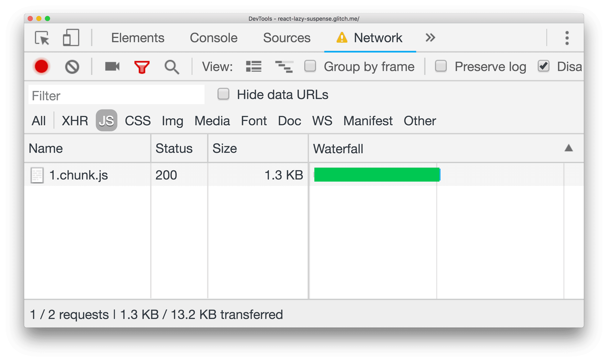

# React.lazy 및 Suspense를 사용한 코드 분할

<div style="margin-top: 16px">
  <Badge type="info" text="React.lazy" />
  <Badge type="info" text="Suspense" />
  <Badge type="info" text="ErrorBoundary" />
</div>

`React.lazy`를 사용하면 동적 가져오기를 통해 컴포넌트 단위로 React 애플리케이션의 코드 분할을 쉽게 구현할 수 있습니다.

```tsx
import { lazy } from "react";

const AvatarComponent = lazy(() => import("./AvatarComponent"));

function DetailsComponent() {
  return (
    <div>
      <AvatarComponent />
    </div>
  );
}
```

## 왜 유용할까?

대규모 React 애플리케이션은 여러 컴포넌트, 유틸리티, 서드 파티 라이브러리로 구성됩니다. 만약 필요한 부분만 로드하지 않는다면, 첫 번째 페이지를 로드하는 즉시 단일의 대규모 JavaScript 번들이 전송되어 성능 저하를 초래할 수 있습니다.

`React.lazy` 는 애플리케이션의 컴포넌트를 별도의 JavaScript 청크로 분리하는 방법을 제공합니다. 이를 `Suspense` 와 함께 사용하면, 비동기 로딩 상태를 관리하며 사용자 경험을 개선할 수 있습니다.

## Suspense

대용량 JavaScript 페이로드를 전송하면 페이지 로드 시간이 길어지고, 특히 네트워크 속도가 느리거나 성능이 낮은 기기에서는 문제가 더욱 심각해집니다. 이 때문에 코드 분할과 지연 로드가 중요한 역할을 합니다.

그러나 코드 분할된 컴포넌트는 네트워크를 통해 동적으로 가져오기 때문에 불가피한 지연이 발생합니다. 따라서 적절한 로딩 상태를 제공하는 것이 중요합니다. `React.lazy` 를 `Suspense` 와 함께 사용하면 이러한 지연을 처리하여 사용자 경험을 개선할 수 있습니다.

```tsx
import { lazy, Suspense } from "react";

const AvatarComponent = lazy(() => import("./AvatarComponent"));

function Loading() {
  return <p>Loading</p>;
}

function DetailsComponent() {
  return (
    <Suspense fallback={<Loading />}>
      <AvatarComponent />
    </Suspense>
  );
}
```

`Suspense` 는 `fallback` prop을 제공하여, 비동기 로드 중인 React 컴포넌트를 로딩 상태로 표시할 수 있도록 합니다.

아래 예시는 그 동작 방식을 보여줍니다. 아바타는 버튼을 클릭할 때만 렌더링되며, 이때 `AvatarComponent` 의 코드를 가져오기 위한 네트워크 요청이 발생합니다. 요청이 완료될 때까지는 fallback UI가 표시됩니다.

<div class="wd-embed" style="height: 480px;">
  <iframe allow="camera; clipboard-read; clipboard-write; encrypted-media; geolocation; microphone; midi" loading="lazy" src="https://glitch.com/embed/#!/embed/react-lazy-suspense?attributionHidden=true&amp;sidebarCollapsed=true&amp;path=src%2Findex.css&amp;previewSize=100" style="height: 100%; width: 100%; border: 0;" data-title="Glitch의 react-lazy-suspense"></iframe>
</div>

`AvatarComponent` 의 코드 크기가 작기 때문에 로딩 스피너는 잠깐만 표시됩니다. 하지만 네트워크 상태가 좋지 않거나 더 큰 구성 요소를 로드해야 하는 경우, 로딩 시간이 훨씬 길어질 수 있습니다.

이 동작을 더 잘 이해하려면 다음 단계를 따라해 봅시다.

- **전체 화면 아이콘**을 누릅니다.
- `Control+Shift+J` (Mac의 경우 `Command+Option+J`)를 눌러 DevTools를 엽니다.
- **네트워크** 탭을 클릭합니다.
- 기본적으로 **제한 없음**으로 설정된 **제한** 드롭다운을 클릭합니다. **빠른 3G**를 선택합니다.
- 앱에서 **Click Me** 버튼을 클릭합니다.

이제 로드 표시기가 더 오래 유지됩니다. 또한 `AvatarComponent` 를 구성하는 코드가 별도의 청크로 로드되는 과정을 확인할 수 있습니다.



## 로드 실패 처리

`Suspense` 를 사용하면 네트워크 요청이 진행되는 동안 임시 로드 상태를 표시할 수 있습니다. 하지만 네트워크 요청을 실패할 수도 있습니다. 예를 들어, 사용자가 오프라인 상태이거나, 서버가 재배포된 후 웹 앱이 더 이상 사용할 수 없는 오래된 버전의 리소스를 로드하려고 시도할 수 있습니다.

React에서는 이러한 로드 실패를 적절히 처리하기 위해 오류 경계(ErrorBoundary) 패턴을 제공합니다.

지연 로드 실패를 감지하고 처리하려면 오류 경계 역할을 하는 `ErrorBoundary` 컴포넌트로 감싸면 됩니다.

:::info

- 오류 경계를 적절한 위치에 배치하는 방법에 대해 알고 싶다면 "[에러 경계 세분화](./에러-경계-세분화하기)"를 확인해 봅시다.
- `ErrorBoundary` 구현 방법에 대해 알고 싶다면 "[선언적으로 비동기 처리하기](./선언적으로-비동기-처리하기#errorboundary)"를 확인해 봅시다.

:::

```tsx
import React, { lazy, Suspense } from "react";

const AvatarComponent = lazy(() => import("./AvatarComponent"));

function Loading() {
  return <p>Loading</p>;
}

function DetailsComponent() {
  return (
    <ErrorBoundary
      renderFallback={({ error, reset }) => (
        <>
          <h1>{error.message}</h1>
          <button onClick={reset}>retry</button>
        </>
      )}
    >
      <Suspense fallback={<Loading />}>
        <AvatarComponent />
      </Suspense>
    </ErrorBoundary>
  );
}
```

## 코드 분할 적용 위치

React 애플리케이션에서 코드 분할을 어디에 적용할지 고민된다면, 다음 단계를 따르는 것이 좋습니다.

1. **경로 수준에서 시작**합니다. 애플리케이션을 분할할 수 있는 가장 기본적인 단위는 경로(Route)입니다.
2. **사용자 상호작용에 의해 렌더링되는 대형 컴포넌트를 식별**합니다. 예를 들어, 특정 버튼을 클릭해야만 렌더링되는 컴포넌트라면, 이를 분할하면 초기 JavaScript 페이로드 크기를 줄일 수 있습니다.
3. **초기 화면에 표시되지 않으며 즉시 필요하지 않은 요소를 분할**합니다. 사용자가 당장 보지 않아도 되는 UI 요소는 코드 분할을 통해 지연 로드하는 것이 성능 최적화에 도움이 됩니다.
