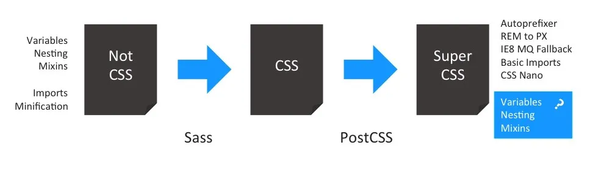
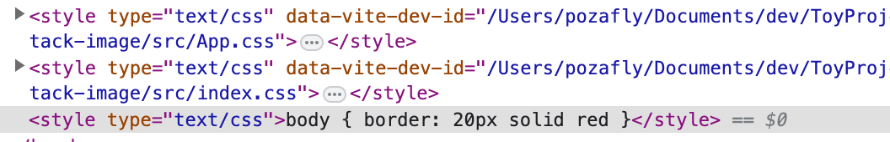
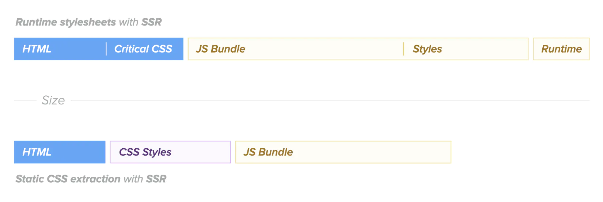
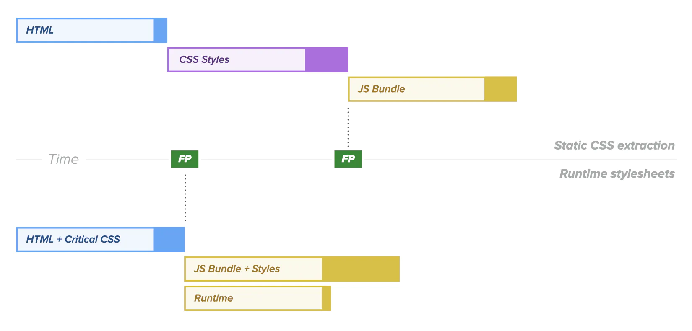
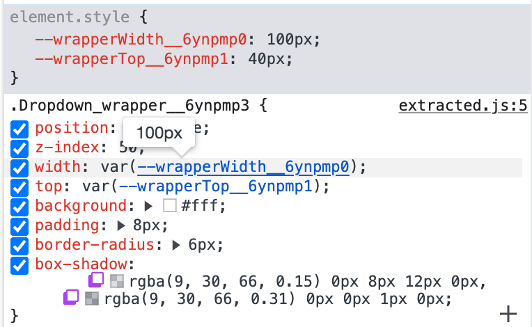
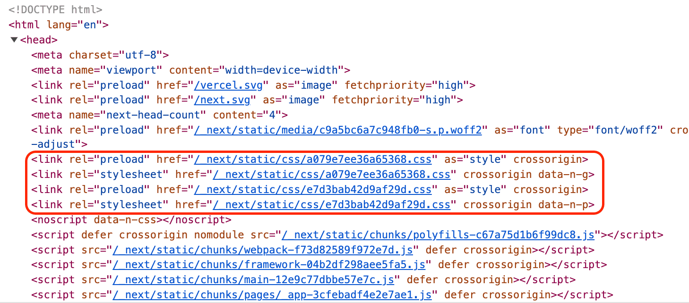

# 모던 CSS 알아보기

<div style="margin-top: 16px">
  <Badge type="info" text="CSS" />
  <Badge type="info" text="CSS-in-JS" />
  <Badge type="info" text="Atomic CSS" />
</div>

:::info
웹페이지가 브라우저에서 렌더링을 시작할 때가지의 단계를 자세히 알고 싶다면, [중요 렌더링 과정(Critical Rendering Path)](../browser/중요-렌더링-과정)을 확인해 봅시다.
:::

## CSS를 적용하는 3가지 방법

CSS를 브라우저에 적용하는 방법은 세 가지가 있으며, 각각 단독으로 사용할 수도 있고 혼합하여 사용할 수도 있습니다.

- Inline(인라인) CSS
- Internal(내부) CSS
- External(외부) CSS

### Inline CSS

초기에 HTML은 문서를 전달하기 위한 용도로 만들어졌습니다. 그러나 문서 내에서 중요한 콘텐츠를 강조하거나, 레이아웃을 다르게 구성하고 싶은 요구가 생겨났습니다. 이에 따라 HTML 태그의 `style` 속성을 사용하여 글자 색상을 변경하거나 폰트 크기를 조절할 수 있게 되었습니다.

```html
<h1 style="color: blue; font-size: 24px;">Hello World</h1>
```

### Internal CSS

Inline CSS는 코드 중복이 많아지고, HTML을 읽을 때 한눈에 파악하기 어렵다는 단점이 있습니다. 이를 보완하기 위해 등장한 개념이 내부 스타일시트입니다. `<head>` 태그 내에 `<style>` 태그를 작성하고, 선택자를 사용하여 스타일을 적용할 수 있습니다.

```html
<head>
  <style>
    h1 {
      color: blue;
      font-size: 24px;
    }
  </style>
</head>
```

### External CSS

Internal CSS의 경우 `<style>` 태그 내에서 모든 스타일을 정의해야 하므로, 스타일이 어느 부분에 적용되는지 파악하기 어렵습니다. 이에 반해, External CSS는 CSS 파일을 외부 리소스로 분리하여 관리할 수 있습니다.

```html
<head>
  <link rel="stylesheet" type="text/css" href="./theme.css" />
</head>
```

외부 CSS를 적용하려면 `<link>` 태그의 `href` 속성에 CSS 파일 경로를 지정하면 됩니다. 브라우저는 HTML을 파싱하는 과정에서 `<head>` 내부의 `<link>` 태그를 만나면, 해당 경로의 CSS 파일을 로드하여 적용합니다.

## Critical CSS

CSS 파일이 커질수록 브라우저가 로드해야 할 파일 크기도 증가하며, CSS 파일을 불러오는 시간과 CSSOM을 생성하는 시간을 늘리는 요인이 됩니다. Critical CSS는 사용자가 페이지를 로드했을 때 스크롤 없이 바로 볼 수 있는 콘텐츠를 최대한 빠르게 렌더링하기 위해 해당 영역에 필요한 CSS만을 미리 추출하여 렌더링하는 기법입니다.


웹페이지는 스크롤 없이 바로 보이는 영역과 스크롤해야만 확인할 수 있는 영역으로 나뉩니다. Critical CSS에서는 이 중 스크롤 없이 보이는 영역을 "above-the-fold"라고 합니다. 사용자가 브라우저에서 URL을 입력해 페이지에 접속하면, 처음 화면에 나타나는 부분이 바로 이 영역이며, 스크롤을 내려야 보이는 부분은 "below-the-fold"에 해당합니다.

기본적으로 CSS는 렌더링 차단 리소스입니다. 브라우저가 Render Tree를 생성한 후에야 Paint 과정으로 넘어갈 수 있기 때문입니다. 그러나 Critical CSS를 사용하면 웹페이지의 성능 FCP(First Contentful Paint) 지표를 개선할 수 있습니다.

구현 방식에 따라 다를 수 있지만 브라우저에서 Critical CSS를 적용하는 데, 일반적으로 Internal(내부) CSS 방식을 사용합니다.

- **Inline(인라인) CSS**: HTML 요소마다 개별적으로 스타일을 적용해야 하므로 코드 중복이 많아지고, 가독성이 떨어지기 때문에 Critical CSS 적용 방식으로 적절하지 않습니다.
- **External(외부) CSS**: 별도의 리소스 파일로 관리되기 때문에, 브라우저가 HTML을 로드한 후 추가로 네트워크 요청을 통해 CSS 파일을 가져와야 합니다. 이로 인해 렌더링 속도가 지연될 수 있어 Critical CSS 적용 방식으로 적합하지 않습니다.

:::tip
Internal CSS는 HTML 파일의 `<style>` 태그 내에 포함되므로, HTML이 로드되는 즉시 스타일을 적용할 수 있습니다. 다만, Critical CSS는 눈에 보이는 영역에 해당하는 스타일만 포함해야 하므로, 파일 크기가 지나치게 커지면 안 됩니다. web.dev에서는 14kB 미만의 CSS 사용을 권장하고 있습니다.
:::

### 최적화

스크롤을 내려야 볼 수 있는 영역(below-the-fold)의 CSS는 일반적으로 External CSS를 활용하여 비동기로 로드하고 적용할 수 있습니다.

아래 `<link>` 태그에 추가 속성 없이 CSS 파일을 가져오면, FCP(First Contentful Paint)는 외부 CSS 파일을 로드한 후에 발생합니다.

```html
<link href="styles.css" />
```


아래 코드는 "above-the-fold" 영역의 CSS를 Internal CSS로 적용합니다. 반면, Critical CSS를 제외한 "below-the-fold" 영역의 CSS는 External CSS로 적용되며, `<link>` 태그에 `rel="preload"` 속성값이 추가하면, FCP와 동시에 외부 CSS 파일을 로드할 수 있습니다.

```html
<style type="text/css">
  h1 {
    color: blue;
    font-size: 24px;
  }
</style>

<link
  rel="preload"
  as="style"
  href="styles.css"
  onload="this.onload=null; this.rel='stylesheet';"
/>
<noscript><link rel="stylesheet" href="styles.css" /></noscript>
```

- `rel="preload"` 와 `as="style"` 속성은 CSS 파일을 비동기적으로 요청합니다.
  - `preload` 는 Critical Rendering Path(CRP)에 필요한 리소스를 미리 로드합니다. `as` 와 함께 사용됩니다.
  - `as` 는 `style`, `media`, `fetch`, `font` 등 다양한 리소스 타입을 지정할 수 있으며, 브라우저는 중요도를 판단하여 최적화합니다. `style` 은 최우선 순위를 가집니다.
    :::info
    리소스 종류는 [MDN](https://developer.mozilla.org/ko/docs/Web/HTML/Element/link#%ED%8A%B9%EC%84%B1)에서 확인할 수 있으며, `as` 의 중요도에 대한 자세한 내용은 [Chrome의 Preload 및 Prefetch 우선순위](https://medium.com/reloading/preload-prefetch-and-priorities-in-chrome-776165961bbf)에서 확인할 수 있습니다.
    :::
- `onload` 는 외부 CSS 파일 로드가 완료되면 실행되는 이벤트로, JavaScript 코드가 실행됩니다.
  - `rel="preload"` 속성은 `rel="stylesheet"` 로 변경되어야 CSS로 인식되어 동작할 수 있습니다.
  - `onload` 를 `null` 로 설정하여, `rel="stylesheet"` 로 변경된 후 중복 실행을 방지합니다.
- `<noscript>` 태그는 JavaScript를 실행하지 않는 브라우저에서 대체 수단으로 사용하기 위해 명시한 것입니다.


## Sass

CSS만으로 웹 페이지에 스타일을 작성하는 데 불편함이 많았기 때문에 Sass가 등장했습니다. Sass는 순수 CSS에 다양한 기능을 추가하여 보다 효율적으로 스타일을 작성할 수 있도록 도와줍니다.

### 확장

CSS는 중첩(nesting) 구문을 지원하지 않지만, Sass에서는 중첩을 사용할 수 있습니다. 이를 통해 선택자 구조를 더욱 직관적으로 파악할 수 있으며, 코드 양도 줄일 수 있다. 또한, Sass는 모듈 기능을 지원하여 스타일을 여러 파일로 나누어 관리할 수 있으며, 나중에 하나로 합칠 수도 있습니다.

뿐만 아니라, 믹스인(Mixin)을 활용하면 반복되는 스타일을 재사용할 수 있어 유지보수성이 높아집니다.

이러한 이유로 Sass는 CSS의 상위 집합(Superset)이라고 할 수 있습니다.

### 언어

언어로서의 의미로 보면, Sass는 트랜스파일(혹은 컴파일)되는 언어입니다. 마치 TypeScript가 JavaScript로 트랜스파일링 되듯, Sass는 CSS로 트랜스파일링 됩니다.

Sass는 전처리기(Pre-Processor) 역할을 한다. 브라우저는 CSS 파일만 인식할 수 있기 때문에, `.sass` 또는 `.scss` 확장자를 가진 파일을 브라우저가 해석할 수 있도록 `.css` 파일로 변환해야 한다. 이 과정을 전처리기가 수행합니다.

즉, 브라우저는 CSS만 이해할 수 있기 때문에, Sass를 활용하여 개발자 경험(DX)을 높이고, 이를 브라우저가 이해할 수 있는 CSS로 변환하는 과정이 필요한 것입니다.

## PostCSS

PostCSS는 후처리기(Post-Processor)로써 CSS를 JavaScript 환경에서 가져와 변환하는 도구입니다.

Sass와 달리 PostCSS는 자체적인 언어 개념이 없습니다. 따라서 확장된 네스팅(nesting) 문법이나 변수를 제공하는 것이 아니라, 기존 CSS에 추가적인 가공을 하는 도구입니다. PostCSS는 플러그인 기반으로 동작하며, 다양한 플러그인을 조합하여 CSS를 변환할 수 있는 환경을 제공합니다. 대표적인 플러그인은 다음과 같습니다.

- [Autoprefixer](https://github.com/postcss/autoprefixer): 브라우저별 vendor prefix(`-moz`, `-webkit` 등)를 자동으로 추가해 줍니다. 이를 통해 다양한 브라우저에서 CSS 오류 없이 하나의 코드만으로 호환성을 확보할 수 있습니다.
- [postcss-preset-env](https://github.com/csstools/postcss-plugins/tree/main/plugin-packs/postcss-preset-env): 최신 CSS 문법을 사용해도 구형 브라우저에서 정상적으로 동작할 수 있도록 변환해 줍니다. JavaScript의 Babel과 유사한 역할을 하며, 특히 `flex` 나 `grid` 같은 문법을 지원하지 않는 IE에서도 사용할 수 있도록 변환합니다. 또한, 폴리필을 지원하며 W3C에 제안된 최신 기능도 사용할 수 있게 해줍니다.
- [css-modules](https://github.com/css-modules/css-modules): JavaScript의 전역 스코프(global scope) 문제가 CSS에서도 발생하는데, 이를 해결하기 위해 CSS를 스코프 단위로 나누어 관리할 수 있도록 도와줍니다. PostCSS에만 종속된 개념은 아니지만, 일반적으로 [postcss-modules](https://github.com/madyankin/postcss-modules)과 함께 사용됩니다.

위와 같이 CSS 코드를 트랜스파일링하며, 전처리기처럼 빌드 타임에 동작합니다.

## 전처리기와 후처리기

전치리기와 후처리기 모두 빌드 타임에 동작합니다. 전처리기는 `.scss` 와 같은 파일을 `.css` 파일로 변환한 후, 후처리 과정에서는 이 `.css` 파일을 다시 처리하여 최종적으로 브라우저에 전달될 `.css` 파일을 생성하는 과정입니다.



"Not CSS"는 개발자가 직접 작성한 `.scss` 와 같은 파일로, Sass를 통해 `.css` 파일로 변환됩니다. 그 후, PostCSS를 사용하여 추가 기능이 포함된 최종 `.css` 파일이 생성됩니다.

CSS-Module은 PostCSS를 플러그인으로 사용하지만, nesting 문법이 없는 순수 CSS를 기반으로 합니다. 즉, 모듈 개념만을 포함한 CSS를 사용하며, 전처리 과정은 없습니다. 따라서 전처리를 사용할 수도 있고, 사용하지 않을 수도 있습니다. 반대로 후처리만 사용할 수도 있고, 아예 후처리를 사용하지 않을 수도 있습니다. 이 선택은 프로젝트 특성에 따라 고려해야 합니다.

전처리기와 후처리기 모두 빌드 과정에서 최종적으로 CSS 형태로 추출되기 때문에, webpack과 같은 빌드 툴에 통합하여 사용할 수 있습니다. 빌드 툴에서 처리기 설정을 통해 Internal CSS나 External CSS로 적용할 수 있습니다.

:::tip
webpack의 경우, Internal CSS는 [style-loader](https://webpack.kr/loaders/style-loader/)를 사용할 수 있고, External CSS는 External CSS는 [MiniCssExtractPlugin](https://webpack.js.org/plugins/mini-css-extract-plugin/)을 사용할 수 있습니다.
:::

## CSS-in-JS

CSS-in-JS는 CSS를 JavaScript 코드로 작성하는 방식입니다. 해당 CSS는 JavaScript 번들에 포함되어 브라우저로 전달된 후, 런타임에 해석됩니다. 하지만 SSR 환경에서도 활용할 수 있도록 CSS를 미리 추출하는 기능을 제공하는 라이브러리도 있습니다.

모던 웹 개발에서는 대부분의 JavaScript 프레임워크가 컴포넌트 기반 개발 방식을 따르고 있습니다. 이에 따라, 컴포넌트 단위로 스타일을 작성할 수 있는 필요성이 커졌으며, CSS-in-JS는 이러한 요구를 해결하는 방식 중 하나로 자리 잡았습니다. 스타일 코드와 컴포넌트 코드가 서로 멀리 떨어져 있는 전통적인 방식과 비교하면, CSS-in-JS는 더 응집도 높게 스타일 관리가 가능합니다.

CSS-in-JS에서 스타일을 적용하는 방법은 크게 두 가지로 나뉩니다.

- 런타임 스타일시트(Runtime Stylesheets)
- 정적 CSS 추출(Static CSS Extraction 또는 Zero-Runtime)

### SSR 환경에서 CSS-in-JS의 Critical CSS

SSR 환경에서 [andreipfeiffer/css-in-js](https://github.com/andreipfeiffer/css-in-js/blob/main/README.md#-critical-css-extraction)에 따르면, CSS-in-JS에서 사용하는 Critical CSS 개념은 기존의 Critical CSS와는 조금 다르게 접근합니다.

- SSR 환경에서는 웹페이지 전체에서 가시적인 부분(visible)의 CSS를 생성합니다.
- 동적 렌더링 또는 지연 로딩(lazy loading) 되는 요소에는 CSS를 생성하지 않습니다.

즉, CSS-in-JS에서의 Critical CSS는 일반적인 스크롤 없이 볼 수 있는 영역(above-the-fold)을 고려하는 것이 아니라, 정적인 전체 페이지의 CSS를 생성하는 방식으로 활용됩니다.

대부분의 CSS-in-JS 라이브러리는 개발 모드에서 Internal CSS을 채택하며, 프로덕션 모드에서는 라이브러리마다 Internal CSS 또는 External CSS로 다른 전략을 적용합니다.

:::info 개발 모드에서 Internal CSS를 채택한 이유
webpack과 같은 번들러는 개발 모드에서 HMR(Hot Module Replacement)을 지원합니다. 소스 코드를 변경할 때, 외부 CSS 파일을 사용하면 변경 사항을 반영하려면 브라우저를 새로고침해야 합니다. 하지만 `<style>` 태그를 사용하면 CSS가 HTML 내부에 포함되므로, `style` 태그만 교체해 주면 새로고침 없이도 변경된 화면을 즉시 확인할 수 있습니다.
:::

### 런타임 스타일시트

CSS-in-JS는 번들링된 JavaScript 파일이 브라우저에서 실행되면서 스타일이 적용되는 방식입니다. 이는 대부분의 CSS-in-JS 라이브러리에서 채택하는 방법으로, HTML 파일이 처음 로드될 때는 `<style>` 태그나 외부 CSS 링크 없이 로드됩니다. 이후, JavaScript 코드 내에 포함된 스타일 코드가 실행되면서 스타일이 적용됩니다.

런타임 스타일시트 방식은 두 가지로 나뉩니다.

- `<style>` 태그를 동적으로 추가한 후, 요소에 스타일을 적용하는 방식
- CSSOM에 직접 스타일 규칙을 추가하는 방식 ([CSSStyleSheet.insertRule()](https://developer.mozilla.org/en-US/docs/Web/API/CSSStyleSheet/insertRule))

#### `<style>` 태그를 동적으로 추가한 후, 요소에 스타일을 적용하는 방식

CSSOM에 직접 스타일 규칙을 추가하는 방식보다는 성능이 좋지 않지만, 디버깅 측면에서 더 선호되는 방식입니다.

```javascript
const css = "body { border: 20px solid red; }";
const head = document.head || document.getElementsByTagName("head")[0];
const style = document.createElement("style");

head.appendChild(style);

style.type = "text/css";
style.styleSheet.cssText = css;
```



#### CSSOM에 직접 스타일 규칙을 추가하는 방식

`CSSStyleSheet.insertRule()` 메서드를 사용하면 CSSOM에 직접 스타일 규칙을 추가할 수 있습니다. 이를 활용하면 `<style>` 태그에 별도로 스타일이 추가되지 않더라도 CSS가 적용되는 것을 확인할 수 있습니다. 즉, CSSOM 트리에 새로운 규칙을 생성하여 삽입하는 방식입니다.

```javascript
const sheet = document.styleSheets[0];
sheet.insertRule("body{ border-bottom: 1px solid #CCC; color: #FF0000; }", 0);
```

이 방법은 stitches.js와 같은 zero-runtime 라이브러리에서 동적으로 스타일 규칙을 삽입할 때 활용됩니다.

CSSOM에 직접 스타일 규칙을 추가하는 방식은 `<style>` 태그를 조작하는 방식보다 성능이 좋으므로, 프로덕션 환경에서 더욱 선호되는 방법입니다.

::: info 이 방식이 더 좋은 이유
브라우저는 스타일을 변경하면 Recalculate Style 단계를 거쳐 요소에 적용된 스타일을 다시 계산합니다. 만약 `<style>` 태그를 변경하면 전체 스타일을 재계산해야 하지만, `CSSStyleSheet.insertRule()` 을 사용하면 변경된 규칙만 처리하면 되므로 스타일 재계산 비용이 줄어듭니다.
:::

### 정적 CSS 추출

CSS-in-JS가 등장한 이후, 런타임에서 스타일을 생성하는 과정에서 발생하는 오버헤드를 줄이기 위해 빌드 시점에 CSS를 미리 생성하여 브라우저에 전달하는 방식이 도입되었습니다. 생성된 CSS 파일은 `<link>` 태그를 통해 브라우저에서 로드됩니다. 이를 zero-runtime이라고 합니다.

이 방식은 가장 기본적인 HTML, CSS, JavaScript를 웹 서버에서 브라우저로 전달하는 형태와 동일하며, 런타임에서 별도의 스타일 생성 비용이 발생하지 않는다는 장점이 있습니다.

또한, Critical CSS를 활용하면 성능을 더욱 최적화할 수 있습니다. 런타임 스타일시트 방식에서는 CSS가 두 번 적용되는 오버헤드가 발생할 수 있지만, 정적 CSS 추출 방식에서는 Critical CSS를 별도로 추출하여 "above-the-fold" 영역에 우선 적용할 수 있습니다. 다만, 극한의 성능 최적화가 필요한 경우를 제외하면 실제로 적용하는 사례는 많지 않습니다.

:::info
사실 이 개념은 새로운 것이 아니라, 이미 Sass에서 사용되던 방식과 유사합니다. 다만, SPA 시대가 도래하면서 CSS-in-JS 기반의 런타임 스타일시트 방식이 주류가 되었고, SSR 환경이 확장되면서 다시 서버에서 CSS를 미리 빌드하는 필요성이 대두되었습니다. 이에 따라 zero-runtime이라는 용어가 등장한 것입니다.
:::

### 런타임 스타일시트와 정적 CSS 추출 성능 비교

아래는 SSR 환경에서 런타임 스타일시트 방식과 정적 CSS 추출 방식이 각각 생성하는 파일의 크기 비교입니다.



정적 CSS 추출 방식을 사용하면 파일 크기가 상대적으로 작아지는 것을 확인할 수 있으나, 단순히 파일 크기만으로 성능을 판단할 수는 없습니다. First Paint도 확인해 봅시다.



정적 CSS 추출 방식은 First Paint가 더 느립니다. 그 이유는 외부 CSS 파일은 렌더링 차단 요소이기 때문입니다. 브라우저는 `.css` 파일을 로드하고 파싱한 후에야 화면을 그릴 수 있으므로, 초기 렌더링 속도가 느려질 수 있습니다.

반면, 런타임 스타일시트 방식은 HTML과 함께 Critical CSS를 먼저 로드받아 즉시 파싱하고 렌더 트리를 생성할 수 있습니다.

이 덕분에 First Paint가 빠르게 이루어질 수 있지만, TTI(Time To Interactive)는 늦어질 가능성이 있습니다. TTI가 지연되는 이유는 런타임 스타일시트 방식에서는 JavaScript 파일을 로드하고 실행해야 CSS가 적용되므로, JavaScript 번들 크기가 커질수록 실행 시간이 길어지기 때문입니다.

하지만, 정적 CSS 추출 방식에서도 Critical CSS를 사용하고 외부 CSS 파일을 비동기 로드하면 First Paint를 더욱 최적화할 수 있습니다.

### 동적 변수

#### 런타임에서 동적 변수

CSS-in-JS의 가장 큰 장점은 상태 값에 따라 동적으로 스타일을 생성할 수 있다는 점입니다.
JavaScript 파일 내에서 CSS를 작성하고 브라우저에서 실행되므로, JavaScript 변수에 CSS 값을 담아 상태 변화에 따라 스타일을 동적으로 변경할 수 있습니다. 이 때문에 CSS-in-JS는 런타임 환경을 필요로 합니다.

#### zero-runtime에서 동적 변수

zero-runtime 환경에서 동적 변수는 일반적으로 CSS 변수를 활용하여 해결합니다.

예를 들어, vanilla-extract의 경우를 살펴봅시다.

```typescript
import { createVar, style } from "@vanilla-extract/css";

export const accentVar = createVar();

export const blue = style({
  vars: {
    [accentVar]: "blue",
  },
});

export const pink = style({
  vars: {
    [accentVar]: "pink",
  },
});
```

빌드 후 생성된 CSS 파일에는 미리 정의된 CSS 변수들이 포함됩니다.

```css
.accent_blue__l3kgsb1 {
  --accentVar__l3kgsb0: blue;
}
.accent_pink__l3kgsb2 {
  --accentVar__l3kgsb0: pink;
}
```

그러나 런타임에서만 계산될 수 있는 값이 필요한 경우가 있습니다. 이럴 때는 `@vanilla-extract/dynamic` 패키지를 활용할 수 있습니다. 이 패키지는 CSS 변수명만 미리 생성해 두고, 런타임에서 값을 계산한 후 해당 변수를 인라인으로 등록하여 스타일을 적용하는 방식을 사용합니다.

::: code-group

```typescript [wrapper.css.ts]
import { createVar, style } from "@vanilla-extract/css";

export const wrapperWidth = createVar();
export const wrapperTop = createVar();

export const wrapper = style({
  width: wrapperWidth,
  top: wrapperTop,
  // ...
});
```

```tsx [Wrapper.tsx]
import { assignInlineVars } from "@vanilla-extract/dynamic";
import { wrapper } from "./style";

export function Wrapper() {
  const width = useMemo(() => {
    // 값 계산
  }, []);
  const targetHeight = useMemo(() => {
    // 값 계산
  }, []);
  const offset = useMemo(() => {
    // 값 계산
  }, []);

  return (
    <div
      className={wrapper}
      style={assignInlineVars({
        [style.wrapperWidth]: width, // 계산된 동적 값
        [style.wrapperTop]: `${targetHeight + offset}px`, // 계산된 동적 값
      })}
    >
      {children}
    </div>
  );
}
```

:::



`@vanilla-extract/dynamic` 패키지는 vanilla-extract monorepo 내부의 패키지로, 크기가 1KB에 불과해 성능 저하가 거의 없습니다.

따라서 zero-runtime 라이브러리라고 해도 엄밀히 말하면 최소한의 런타임이 존재할 수 있습니다.

## Atomic CSS

Atomic CSS는 웹사이트의 스타일을 최소 단위로 분리하여, 각 단위별로 이름을 지정해 CSS를 작성하는 방식입니다. CSS-in-JS에서는 작성한 만큼 JavaScript 번들이나 CSS 파일에 포함되지만, 재사용 가능한 스타일을 한 번 정의된 스타일로 공유하면 번들 크기를 줄일 수 있습니다.

Atomic CSS 중 유명한 프레임워크는 TailwindCSS가 있습니다.

```tsx
<figure class="md:flex bg-slate-100 rounded-xl p-8 md:p-0 dark:bg-slate-800">
  
  <div class="pt-6 md:p-8 text-center md:text-left space-y-4">
    <blockquote>
      <p class="text-lg font-medium">
        “Tailwind CSS is the only framework that I've seen scale
        on large teams. It’s easy to customize, adapts to any design,
        and the build size is tiny.”
      </p>
...
```

위 코드처럼 클래스에 스타일 값을 입력하면 자동으로 스타일이 적용됩니다. 따라서 직접 스타일을 타이핑할 일이 줄어듭니다.

빌드 후 프로덕션 모드에서 확인해 보면, 별도의 `.css` 파일이 생성되며, 외부 링크를 통해 preload 되는 방식을 확인할 수 있습니다.



### 성능

TailwindCSS 빌드 결과를 보면 성능이 좋은 이유를 알 수 있습니다.

```css
.p-24 {
  padding: 6rem;
}
.p-8 {
  padding: 2rem;
}
.px-5 {
  padding-left: 1.25rem;
  padding-right: 1.25rem;
}
.py-4 {
  padding-top: 1rem;
  padding-bottom: 1rem;
}
.pb-6 {
  padding-bottom: 1.5rem;
}
.pt-8 {
  padding-top: 2rem;
}
```

TailwindCSS는 사용되지 않는 CSS를 제거하는 `content` 옵션을 제공합니다. 이 덕분에 대규모 프로젝트에서도 최종 CSS 파일 크기가 10KB 미만으로 유지될 수 있습니다. 이는 빌드 툴의 Tree Shaking 개념과 유사합니다.

또한, TailwindCSS는 [Just-In-Time](https://v2.tailwindcss.com/docs/just-in-time-mode)(JIT) 모드를 사용합니다. 2.1 버전 이상부터 기본적으로 활성화된 이 모드는 빌드 속도를 향상시키고 개발 환경에서의 성능을 개선합니다.

:::info
최종 CSS 파일 크기가 작기 때문에, TailwindCSS는 페이지별로 다른 Critical CSS 옵션을 제공하지 않습니다.
:::

### 동적 변수

TailwindCSS는 런타임에서 동적 값을 계산할 수 없습니다. 하지만 JIT 모드에서는 동적 값을 사용할 수 있으며, 이는 빌드 시점에 CSS 값이 계산되어 적용되는 방식입니다.

아래 코드는 22px과 110px은 미리 지정된 값 중에서 선택하는 방식이므로 빌드 시 적용이 가능합니다.

```tsx
<div className={size === 'lg' ? 'text-[22px]' : 'text-[110px]'}>
```

```css
.text-\[110px\] {
  font-size: 110px;
}
.text-\[22px\] {
  font-size: 22px;
}
```

하지만 동적인 계산이 필요한 경우, TailwindCSS에서는 인라인 스타일을 사용하라고 권장합니다.

```tsx
// ✅ style을 사용했기 때문에 사용 가능
<div style={`background-color: ${userThemeColor}`}></div>

// ⛔️ 빌드 타임에 CSS를 생성할 수 없기 때문에 className은 동적으로 매칭 불가능
<div className={`bg-[${userThemeColor}]`}></div>
```
