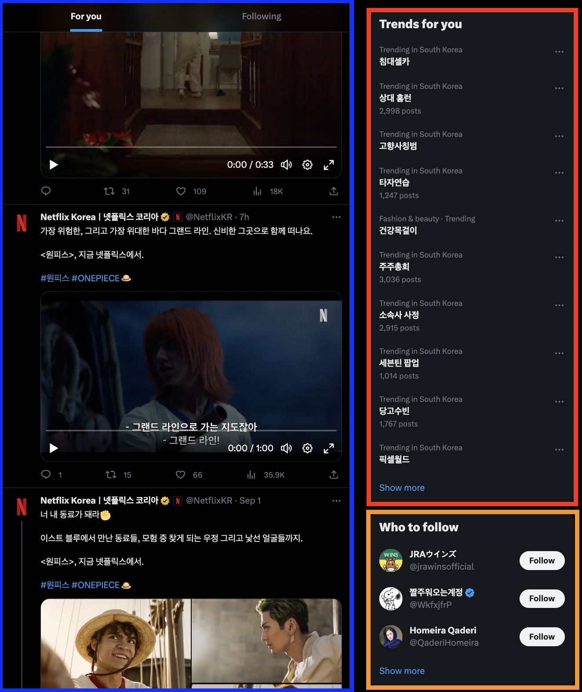
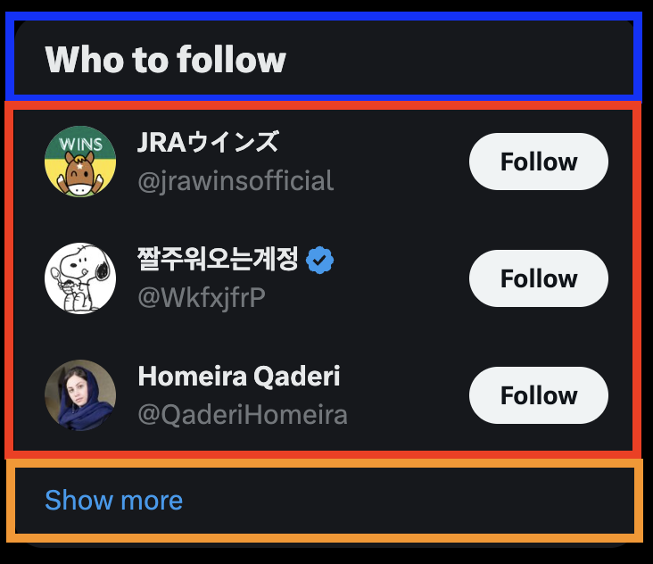

# 에러 경계 세분화하기

<div style="margin-top: 16px">
  <Badge type="info" text="ErrorBoundary" />
</div>

## 🔔 상황

현대적인 애플리케이션을 구축하는 과정은 다양한 구성 요소가 얽힌 복잡한 작업입니다. 오류를 방지하려 노력하지만, 예기치 못한 방식으로 발생할 수 있습니다. 그러나 모든 컴포넌트에 `ErrorBoundary` 를 적용하면 성능 저하와 함께 손상된 UI로 인해 사용자 경험이 악화될 수 있습니다.

## 🎳 해결법

`ErrorBoundary` 를 적절한 위치에 배치하려면, "이 컴포넌트의 오류가 형제 컴포넌트에 영향을 미쳐야 하는가?"라는 질문을 재귀적으로 던져야 합니다. 만약 영향을 미칠 필요가 없다면, 해당 컴포넌트에 `ErrorBoundary` 를 래핑할 수 있는 좋은 후보가 됩니다.

## 너무 적은 에러 경계

애플리케이션이 오류 내성을 가질 수 있도록 `ErrorBoundary` 를 위치시켜야 합니다. 오류 내성(Fault Tolerance)이란, 시스템에 결함이 발생하더라도 정상적으로 동작할 수 있는 능력을 의미합니다.

극단적인 예로, 애플리케이션 최상위에 단일 ErrorBoundary를 배치해 보겠습니다.

```tsx
<ErrorBoundary>
  <Component {...pageProps} />
</ErrorBoundary>
```

이 위치에 `ErrorBoundary` 를 두면, 하나의 오류로 인해 애플리케이션 전체가 실패할 위험이 있습니다. 이는 서버 사이드 렌더링된 애플리케이션이 실패할 때와 유사한 상황을 초래합니다.

만약 애플리케이션의 특정 부분에서 발생한 오류가 전체 시스템을 사용할 수 없게 만드는 경우라면, 이 접근 방식이 적절할 수 있습니다. 하지만 대부분의 경우 그렇지 않습니다.

결국, 단일 `ErrorBoundary` 는 실제로 오류 내성을 제공하지 않습니다. 단 하나의 오류로 인해 애플리케이션 전체가 중단될 수 있기 때문입니다.

## 너무 많은 에러 경계

극단적으로 모든 컴포넌트를 `ErrorBoundary` 로 감싸는 방법을 생각해볼 수도 있습니다. 하지만 이는 단일 `ErrorBoundary` 를 사용하는 것보다 더 나쁜 결과를 초래할 수 있습니다.

예를 들어, `CheckoutForm` 컴포넌트를 가정해 보겠습니다. 이 컴포넌트는 사용자가 카트에 담아 있는 금융 상품을 확인하고, 계좌 번호를 입력하여 가입을 완료할 수 있도록 합니다. 이제 이 컴포넌트 내의 모든 요소를 개별 `ErrorBoundary` 로 감싸봅시다.

```tsx
<CheckoutForm>
  <ErrorBoundary>
    <CheckoutForm.Cart />
  </ErrorBoundary>

  <ErrorBoundary>
    <CheckoutForm.AccountInput />
  </ErrorBoundary>

  <ErrorBoundary>
    <CheckoutForm.CheckoutButton />
  </ErrorBoundary>
</CheckoutForm>
```

:::tip
현재 Wrapper 컴포넌트로 `ErrorBoundary` 를 적용했습니다. 또한 HOC(Higher-Order Component) 방식인 `withErrorBoundary` 로 적용할 수 있습니다.
:::

무분별하게 `ErrorBoundary`를 사용하면,

- 오류와 관련된 상태와 로직이 많아져 메모리 사용량과 렌더링이 비용이 증가합니다.
- 일부가 고장난 UI는 완전히 고장난 UX로 이어질 수 있습니다.
- 많은 fallback UI를 작성하는 것은 불가능한 일입니다.

### 일부가 고장난 UI == 완전히 고장난 UX

처음에는 이 아이디어가 괜찮아 보일 수 있습니다. 에러 경계를 더 세분화하면 단일 실패가 전체 애플리케이션에 미치는 영향을 줄일 수 있을 것입니다. 이는 오류 내성처럼 들릴 수 있습니다. 하지만 이 방법의 문제는 오류의 영향을 최소화하는 것이 실제로 오류 내성과 동일하지 않다는 점입니다.

예를 들어, `AccountInput` 컴포넌트에서 오류가 발생했다고 가정해 봅시다.

```tsx
// ...
<ErrorBoundary>
  {/* 오류 발생 */}
  <CheckoutForm.AccountInput />
</ErrorBoundary>
// ...
```

`AccountInput` 컴포넌트가 자체적인 `ErrorBoundary` 를 가지고 있기 때문에 상위나 형제 컴포넌트는 사용자에게 정상적으로 노출될 것입니다. 하지만 사용자가 계좌번호를 입력하지 않으면 상품 가입을 완료할 수 없는 상황이 발생하여, UX가 저하됩니다.

따라서 일부가 고장난 UI는 완전히 고장난 UX로 이어질 수 있습니다.

### 너무 많은 fallback UI

모든 컴포넌트를 `ErrorBoundary` 로 래핑한다면, fallback UI는 모든 UI 요소에 대해 올바르게 렌더링되어야 합니다. 그러나 이는 사실상 불가능한 일입니다. 각 요소가 다른 레이아웃을 가지기 때문에 이를 일관되게 처리하기 어려운 경우가 많습니다. 예를 들어, 헤더, 바디, 풋터와 같은 큰 섹션에는 적합할 수 있지만, 작은 아이콘 버튼에는 적합하지 않을 수 있습니다. 이로 인해 애플리케이션은 일관되지 않은 상태가 되어 사용자에게 혼란을 줄 수 있습니다.

## 올바른 양의 에러 경계

에러 경계의 '올바른 양'은 애플리케이션마다 다르기 때문에 정확한 숫자는 없습니다. 가장 좋은 접근 방법은 '이 컴포넌트의 오류가 형제 컴포넌트에 영향을 미쳐야 하는가?'라는 질문을 재귀적으로 던져 에러 경계의 위치를 식별하는 것입니다.

사용자 인터페이스(UI)는 종종 재귀적인 구조를 가지고 있습니다. 페이지 레벨에서 헤더와 풋터와 같은 큰 컴포넌트들이 있지만, 이러한 컴포넌트 내부에는 또 다른 컴포넌트들이 포함됩니다. 이런 재귀적인 구조를 따라가면서 질문을 던지는 것입니다.

위의 `CheckoutForm` 컴포넌트 예제에서 질문을 고려해 보면 "만약 `AccountInput` 의 오류는 `CheckoutButton` 와 `Cart` 에 영향을 미쳐야 하는가?" 입니다.

### 예시: 트위터

재귀적인 물음을 트위터에 적용해 봅시다.

:::warning
아래 분석은 주관적인 의견과 편향이 포함될 수 있습니다. 이는 단지 과정 자체에 대한 느낌을 전달하고자 하는 목적입니다.
:::



페이지 레벨에 있는 컴포넌트를 찾아 보면, "Home", "Trends for you", "Who to follow" 컴포넌트가 있습니다. 이제 각 컴포넌트의 오류가 형제 컴포넌트에 영향을 줘야 하는지 질문을 합니다.

"Home", "Trends for you" 컴포넌트는 "Who to follow" 컴포넌트와 의존 관계가 없기 때문에, "Who to follow" 컴포넌트에서 오류가 발생해도, "Home"과 "Trends for you" 컴포넌트에 영향을 주지 않아도 됩니다. 따라서 "Who to follow" 컴포넌트는 에러 경계를 두기 좋은 위치라고 생각합니다.

같은 방식으로 "Who to follow" 컴포넌트에도 적용해 봅시다.



"Who to follow" 컴포넌트의 하위 컴포넌트를 찾아 보면, "제목", "팔로우 추천 목록", "더 보기 링크" 컴포넌트가 있습니다. 동일하게 각 컴포넌트의 오류가 형제 컴포넌트에 영향을 줘야 하는지 질문을 합니다.

"팔로우 추천 목록" 컴포넌트에서 오류가 발생해도, "제목"을 유지하는 것과 "더 보기 링크"가 다른 페이지로 이동하는 동작은 문제 없이 가능합니다. 따라서 "팔로우 추천 목록"에 에러 경계를 두기 좋은 위치라고 생각합니다.

같은 방식으로 "팔로우 추천 목록" 컴포넌트에도 적용해 봅시다.


"팔로워 추천 목록" 컴포넌트의 하위 컴포넌트를 찾아 보면, "사용자 정보"와 "팔로우 버튼"가 있습니다.

동일하게 질문을 하면, "사용자 정보" 컴포넌트 오류가 "팔로우 버튼"에 영향을 미쳐야 합니다. 그 반대의 경우도 마찬가지입니다. 사용자의 정보가 없다면 누구를 팔로우하는지 알 수 없을 것입니다. 마찬가지로 팔로우 버튼이 없다면 추천만 받았지 아무런 액션을 취할 수 없어서 사용자는 혼란스러울 것입니다. 따라서 두 컴포넌트 모두 에러 경계를 추가하지 않습니다.
