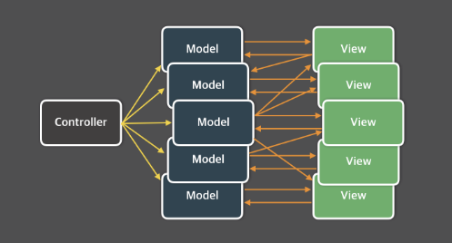
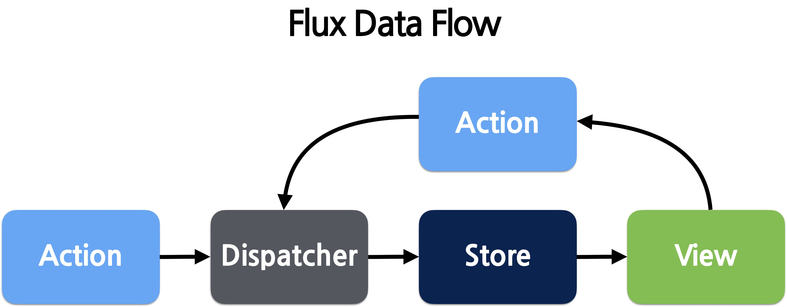

# Flux 아키텍처 알아보기

  <Badge type="info" text="Redux" />
  <Badge type="info" text="Architecture" />

## 상태 관리의 복잡도가 높아지는 문제

SPA가 등장한 이후, 다양한 요구사항이 반영되면서 애플리케이션의 규모가 점점 커졌습니다. 규모가 커졌다는 것은 그만큼 관리해야 할 상태(state)도 많아졌다는 의미입니다.

이러한 상태에는 서버에서 받아와 캐싱된 데이터뿐만 아니라 로컬에서 사용하는 데이터도 포함됩니다. 또한, UI 컴포넌트의 상태까지 관리해야 할 경우도 많습니다.

애플리케이션의 규모가 커지고 상태가 많아질수록, **언제, 어디서, 어떻게 상태가 업데이트되는지** 파악하기 어려워집니다. 이는 디버깅과 새로운 기능을 추가하는 데도 영향을 줍니다.

버그를 효과적으로 수정하려면 먼저 버그를 재현할 수 있어야 합니다. 하지만 상태 업데이트의 원인을 파악할 수 없다면, 버그를 재현하는 것도, 수정하는 것도 어렵습니다.

이러한 문제를 해결하고 상태 관리를 보다 명확하게 하기 위해 Flux 아키텍처가 등장하게 되었습니다.

:::info MVC 아키텍처의 한계
Controller는 Model의 데이터를 조회하거나 업데이트하는 역할을 하며, Model은 변경된 데이터를 View에 반영합니다. 또한, View는 사용자와의 상호작용을 통해 Model에 영향을 주기도 합니다.

그러나 이러한 구조는 규모가 큰 애플리케이션에서 상태 관리의 복잡성을 증가시킬 수 있습니다.

이 문제에 대해 자세히 알고 싶다면, [Meta의 컨퍼런스 영상](https://youtu.be/nYkdrAPrdcw?si=0Eu4bom1NaRzlYI6)을 확인해 봅시다.

:::

## Flux 아키텍처란

Flux 공식 [GitHub](https://github.com/facebookarchive/flux)에서는 Flux를 **"단방향 데이터 흐름을 활용한 리액트용 애플리케이션 아키텍처"**라고 정의합니다. 이는 특정 라이브러리가 아니라, 상태 관리를 위한 추상적인 개념을 구조화한 설계 방식입니다.

Redux는 이러한 Flux 아키텍처를 실제로 구현한 라이브러리입니다.

Action은 데이터를 변경하는 이벤트입니다.

이 Action이 발생하면, Dispatcher가 이를 받아 처리합니다. Dispatcher는 이름 그대로 Action을 전달하는 역할을 하며, 최종적으로 Redux에 Action이 전달됩니다.

이후, 변경된 데이터는 Store에 저장됩니다. Store는 애플리케이션의 상태를 관리하는 중앙 저장소이며, 이곳에 저장된 데이터는 View에서 가져와 사용자에게 표시됩니다.

만약 View에서 또 다른 Action을 발생시키면, 동일한 단방향 데이터 흐름을 따라 처리됩니다.
